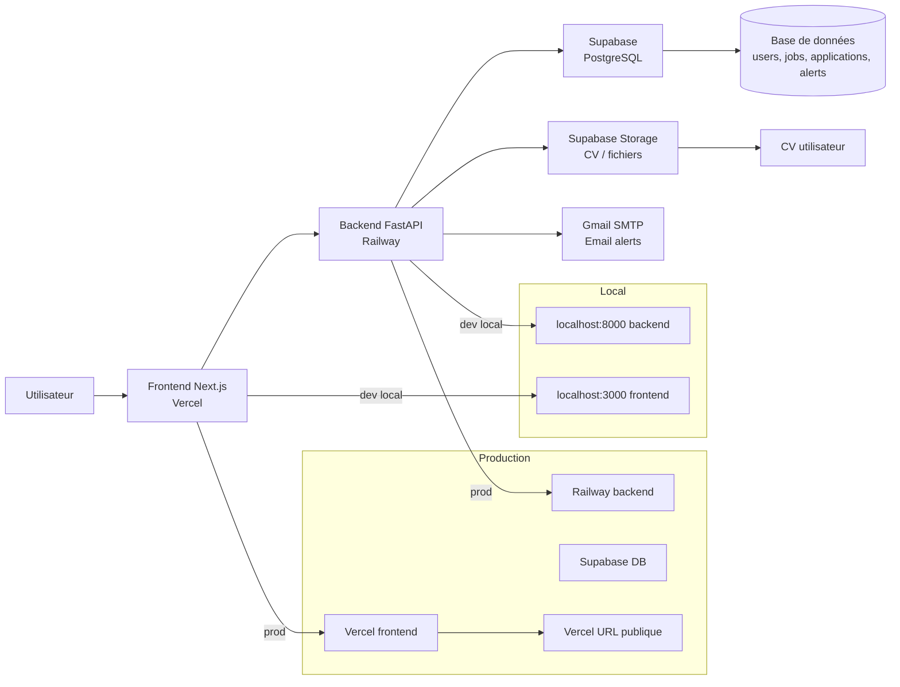

# Job Hunter AI - Sprint 1

## 1. Architecture

### 1.1 Vue d'ensemble

Le Sprint 1 cible la mise en production d'une base infra exploitable, autonome et publiquement déployable, sans dépendance à Capgemini et sans dépendance à un environnement local.

Les composants clés sont :
- Frontend Next.js + React + TypeScript + Tailwind
- Backend FastAPI + Python
- Base de données PostgreSQL via Supabase
- Email SMTP Gmail
- Stockage de CV via Supabase Storage
- Environnements local et production distincts

### 1.2 Composants

#### Frontend
- Stack : Next.js, React, TypeScript, Tailwind
- Rôle : interface utilisateur pour authentification, tableau de bord, candidatures, alertes, CV
- Déploiement : Vercel
- URL publique : https://job-hunter-ai.vercel.app (ou nom personnalisé)

#### Backend
- Stack : FastAPI, Python
- Rôle : API REST, logique métier, matching, envoi email, orchestration
- Déploiement : Railway
- Rôle main : exposer les endpoints, validation, service de données, sécurité

#### Base de données
- Stack : PostgreSQL via Supabase
- Rôle : persistance des utilisateurs, emplois, candidatures, alertes, CV metadata
- Avantages : hébergement gratuit / léger, SQL fiable, intégration simple avec l'API

#### Service email
- Stack : Gmail SMTP
- Rôle : envoi des alertes et notifications
- Avantages : gratuit, simple, déjà validé

#### Stockage CV utilisateur
- Stack : Supabase Storage
- Rôle : stockage du CV utilisateur, indexation / référence dans la table users ou documents
- Sécurité : bucket privé avec signed URLs ou accès restreint

#### Environnement local
- Frontend : localhost:3000
- Backend : localhost:8000
- Base : PostgreSQL local ou Supabase dev
- Fichier de config : .env local

#### Environnement production
- Frontend : Vercel
- Backend : Railway
- DB : Supabase
- Email : Gmail SMTP
- Base URL publique : APP_BASE_URL

### 1.3 Flux de fonctionnement

1. L'utilisateur accède au frontend.
2. Le frontend appelle le backend FastAPI.
3. Le backend se connecte à Supabase PostgreSQL.
4. Le backend traite les données de candidatures / alertes.
5. Le backend envoie un email SMTP Gmail si un seuil est atteint.
6. Les liens email pointent vers APP_BASE_URL pour travailler en production.

### 1.4 Diagramme Mermaid



---

## 2. Structure du projet

```text
/job-hunter-ai
├── .github/
│   └── workflows/
│       └── ci.yml
├── frontend/
│   ├── app/
│   ├── components/
│   ├── lib/
│   ├── public/
│   ├── src/
│   ├── .env.local.example
│   ├── package.json
│   ├── next.config.mjs
│   ├── tailwind.config.ts
│   ├── tsconfig.json
│   └── README.md
├── backend/
│   ├── app/
│   ├── tests/
│   ├── .env.example
│   ├── requirements.txt
│   ├── Dockerfile
│   └── README.md
├── database/
│   └── supabase/
│       ├── schema.sql
│       ├── seed.sql
│       └── README.md
├── docs/
│   ├── architecture-sprint1.md
│   ├── deployment-vercel.md
│   ├── deployment-railway.md
│   └── environment.md
├── scripts/
│   ├── init-db.sh
│   ├── verify-env.sh
│   └── smoke-test.sh
├── .gitignore
├── README.md
├── docker-compose.yml
└── .env.example
```

### Rôle des dossiers

#### .github/
- CI/CD, validation GitHub, vérification des builds

#### frontend/
- application Next.js pour l'interface utilisateur
- composants UI, pages, hooks, appels API

#### backend/
- API FastAPI, logique métier, sécurité, services, tests

#### database/supabase/
- schéma SQL, scripts d'initialisation, documentation de la base

#### docs/
- documentation technique, architecture, déploiement, variables

#### scripts/
- outils d'automatisation, validation, smoke tests, init DB

---

## 3. Modèle de données Supabase

### 3.1 Tables minimales
- users
- jobs
- applications
- alerts

### 3.2 Schéma SQL complet

```sql
-- Extension utile pour UUID
CREATE EXTENSION IF NOT EXISTS "pgcrypto";

CREATE TABLE IF NOT EXISTS users (
    id UUID PRIMARY KEY DEFAULT gen_random_uuid(),
    email VARCHAR(255) NOT NULL UNIQUE,
    full_name VARCHAR(255),
    password_hash VARCHAR(255),
    created_at TIMESTAMPTZ NOT NULL DEFAULT NOW(),
    updated_at TIMESTAMPTZ NOT NULL DEFAULT NOW(),
    cv_url TEXT,
    status VARCHAR(50) DEFAULT 'active'
);

CREATE INDEX IF NOT EXISTS idx_users_email ON users(email);
CREATE INDEX IF NOT EXISTS idx_users_created_at ON users(created_at);

CREATE TABLE IF NOT EXISTS jobs (
    id UUID PRIMARY KEY DEFAULT gen_random_uuid(),
    source VARCHAR(100) NOT NULL,
    external_id VARCHAR(255),
    title VARCHAR(255) NOT NULL,
    company VARCHAR(255),
    location VARCHAR(255),
    contract_type VARCHAR(100),
    url TEXT NOT NULL,
    description TEXT,
    skills TEXT[],
    salary_min NUMERIC(12,2),
    salary_max NUMERIC(12,2),
    is_remote BOOLEAN DEFAULT FALSE,
    created_at TIMESTAMPTZ NOT NULL DEFAULT NOW(),
    updated_at TIMESTAMPTZ NOT NULL DEFAULT NOW(),
    UNIQUE (source, external_id)
);

CREATE INDEX IF NOT EXISTS idx_jobs_source ON jobs(source);
CREATE INDEX IF NOT EXISTS idx_jobs_title ON jobs(title);
CREATE INDEX IF NOT EXISTS idx_jobs_created_at ON jobs(created_at);
CREATE INDEX IF NOT EXISTS idx_jobs_location ON jobs(location);
CREATE INDEX IF NOT EXISTS idx_jobs_skills ON jobs USING GIN (skills);

CREATE TABLE IF NOT EXISTS applications (
    id UUID PRIMARY KEY DEFAULT gen_random_uuid(),
    user_id UUID NOT NULL REFERENCES users(id) ON DELETE CASCADE,
    job_id UUID REFERENCES jobs(id) ON DELETE SET NULL,
    status VARCHAR(100) NOT NULL DEFAULT 'new',
    applied_at TIMESTAMPTZ NOT NULL DEFAULT NOW(),
    cover_letter TEXT,
    cv_url TEXT,
    source VARCHAR(100),
    notes TEXT,
    created_at TIMESTAMPTZ NOT NULL DEFAULT NOW(),
    updated_at TIMESTAMPTZ NOT NULL DEFAULT NOW()
);

CREATE INDEX IF NOT EXISTS idx_applications_user_id ON applications(user_id);
CREATE INDEX IF NOT EXISTS idx_applications_job_id ON applications(job_id);
CREATE INDEX IF NOT EXISTS idx_applications_status ON applications(status);
CREATE INDEX IF NOT EXISTS idx_applications_applied_at ON applications(applied_at);

CREATE TABLE IF NOT EXISTS alerts (
    id UUID PRIMARY KEY DEFAULT gen_random_uuid(),
    user_id UUID NOT NULL REFERENCES users(id) ON DELETE CASCADE,
    job_id UUID REFERENCES jobs(id) ON DELETE SET NULL,
    score NUMERIC(5,2) NOT NULL DEFAULT 0,
    status VARCHAR(100) NOT NULL DEFAULT 'pending',
    email_sent BOOLEAN NOT NULL DEFAULT FALSE,
    message TEXT,
    created_at TIMESTAMPTZ NOT NULL DEFAULT NOW(),
    updated_at TIMESTAMPTZ NOT NULL DEFAULT NOW()
);

CREATE INDEX IF NOT EXISTS idx_alerts_user_id ON alerts(user_id);
CREATE INDEX IF NOT EXISTS idx_alerts_job_id ON alerts(job_id);
CREATE INDEX IF NOT EXISTS idx_alerts_status ON alerts(status);
CREATE INDEX IF NOT EXISTS idx_alerts_score ON alerts(score);

CREATE OR REPLACE FUNCTION set_updated_at()
RETURNS TRIGGER AS $$
BEGIN
    NEW.updated_at = NOW();
    RETURN NEW;
END;
$$ LANGUAGE plpgsql;

CREATE TRIGGER trg_users_updated_at
BEFORE UPDATE ON users
FOR EACH ROW EXECUTE FUNCTION set_updated_at();

CREATE TRIGGER trg_jobs_updated_at
BEFORE UPDATE ON jobs
FOR EACH ROW EXECUTE FUNCTION set_updated_at();

CREATE TRIGGER trg_applications_updated_at
BEFORE UPDATE ON applications
FOR EACH ROW EXECUTE FUNCTION set_updated_at();

CREATE TRIGGER trg_alerts_updated_at
BEFORE UPDATE ON alerts
FOR EACH ROW EXECUTE FUNCTION set_updated_at();
```

### 3.3 Scripts de création

#### database/supabase/schema.sql
- fichier complet du schéma SQL ci-dessus

#### database/supabase/seed.sql
```sql
INSERT INTO users (email, full_name, status)
VALUES
    ('demo@jobhunter.ai', 'Demo User', 'active');
```

### 3.4 Description des tables

#### users
- stockage des comptes utilisateurs
- email, profil, CV, statut

#### jobs
- offres collectées / importées
- titres, compétences, URL, source

#### applications
- liens entre utilisateur et job
- statut de candidatures

#### alerts
- déclenchements d’alertes selon score de matching
- email envoyé, message, statut

---

## 4. Variables d'environnement

### frontend/.env.local
```env
NEXT_PUBLIC_APP_NAME="Job Hunter AI"
NEXT_PUBLIC_API_URL="https://your-backend.up.railway.app"
NEXT_PUBLIC_APP_BASE_URL="https://job-hunter-ai.vercel.app"
NEXT_PUBLIC_SUPABASE_URL="https://xxxxxxxxxxxxx.supabase.co"
NEXT_PUBLIC_SUPABASE_ANON_KEY="xxxxxxxxxxxxxxxxxxxx"
```

### backend/.env
```env
APP_NAME=Job Hunter AI
APP_ENV=production
APP_BASE_URL=https://job-hunter-ai.vercel.app
API_V1_PREFIX=/api/v1

DATABASE_URL=postgresql://postgres:postgres@db:5432/jobhunter
SUPABASE_URL=https://xxxxxxxxxxxxx.supabase.co
SUPABASE_KEY=xxxxxxxxxxxxxxxxxxxx
SUPABASE_SERVICE_ROLE_KEY=xxxxxxxxxxxxxxxxxxxx

SMTP_HOST=smtp.gmail.com
SMTP_PORT=587
SMTP_USER=your-email@gmail.com
SMTP_PASSWORD=your-gmail-app-password
EMAIL_TO=your-email@gmail.com

JWT_SECRET=change-me-in-production
SECRET_KEY=change-me-in-production
ALLOWED_ORIGINS=https://job-hunter-ai.vercel.app,http://localhost:3000

EMAIL_THRESHOLD=85
DAILY_SUMMARY_TIME=08:00
SCHEDULER_INTERVAL_MINUTES=60

AWS_REGION=eu-west-3
```

### Variables additionnelles pertinentes
- CORS origins
- secrets JWT
- service role key Supabase
- SUPABASE_STORAGE_BUCKET
- FRONTEND_URL
- BACKEND_URL

---

## 5. Déploiement Vercel

### 5.1 Étapes détaillées
1. Créer un compte Vercel.
2. Importer le repo GitHub.
3. Choisir le dossier frontend comme racine de projet.
4. Sélectionner le framework Next.js.
5. Définir la commande de build.
6. Ajouter les variables d'environnement.
7. Déployer.
8. Récupérer l'URL publique.

### 5.2 Configuration recommandée
- Framework : Next.js
- Root directory : frontend
- Build command : npm run build
- Output directory : .next

### 5.3 Variables d'environnement Vercel
```env
NEXT_PUBLIC_APP_NAME="Job Hunter AI"
NEXT_PUBLIC_API_URL="https://your-backend.up.railway.app"
NEXT_PUBLIC_APP_BASE_URL="https://job-hunter-ai.vercel.app"
NEXT_PUBLIC_SUPABASE_URL="https://xxxxxxxxxxxxx.supabase.co"
NEXT_PUBLIC_SUPABASE_ANON_KEY="xxxxxxxxxxxxxxxxxxxx"
```

### 5.4 Vérifications post-déploiement
- L'URL est accessible
- la page d'accueil charge
- appel API backend OK
- pas d'erreur CORS
- liens email valides

### 5.5 Objectif final
```text
https://job-hunter-ai.vercel.app
```

---

## 6. Déploiement Railway

### 6.1 Étapes détaillées
1. Créer un compte Railway.
2. Créer un nouveau projet.
3. Déployer depuis GitHub.
4. Dossier racine : backend
5. Définir la commande de démarrage : uvicorn app.main:app --host 0.0.0.0 --port ${PORT:-8000}
6. Ajouter les variables d'environnement.
7. Vérifier l'URL publique.

### 6.2 Configuration FastAPI
```python
import os
from fastapi import FastAPI
from fastapi.middleware.cors import CORSMiddleware

app = FastAPI(title="Job Hunter AI API")

app.add_middleware(
    CORSMiddleware,
    allow_origins=["https://job-hunter-ai.vercel.app", "http://localhost:3000"],
    allow_credentials=True,
    allow_methods=["*"],
    allow_headers=["*"],
)
```

### 6.3 Variables d'environnement Railway
```env
APP_NAME=Job Hunter AI
APP_ENV=production
APP_BASE_URL=https://job-hunter-ai.vercel.app
DATABASE_URL=postgresql://...
SUPABASE_URL=https://...
SUPABASE_KEY=...
SUPABASE_SERVICE_ROLE_KEY=...
SMTP_HOST=smtp.gmail.com
SMTP_PORT=587
SMTP_USER=your-email@gmail.com
SMTP_PASSWORD=your-app-password
EMAIL_TO=your-email@gmail.com
ALLOWED_ORIGINS=https://job-hunter-ai.vercel.app,http://localhost:3000
```

### 6.4 Tests à effectuer
- health check sur `/health`
- endpoint API de base
- requête DB
- envoi email de test
- CORS vérifié

---

## 7. Stratégie pour remplacer localhost par APP_BASE_URL

### Problème actuel
Aujourd'hui, les liens utilisent localhost et ne sont pas utilisables hors environnement local.

### Solution cible
Créer une règle unique de génération de liens :

```python
APP_BASE_URL = os.getenv("APP_BASE_URL", "http://localhost:3000")
```

Dans le service d'email :
```python
from app.config import settings

base_url = settings.app_base_url.rstrip("/")
link = f"{base_url}/jobs/{job_id}"
```

### Règles de génération
- si `APP_BASE_URL` est défini -> utiliser cette valeur
- sinon -> utiliser localhost en dev
- ne jamais hardcoder `https://example.com` ou `localhost` dans les emails

### Bonnes pratiques
- utiliser la config centralisée
- éviter les valeurs codées en dur dans les composants
- s'assurer que tous les emails utilisent `APP_BASE_URL`

---

## 8. Plan de validation Sprint 1

### Checklist
- [ ] Frontend accessible publiquement
- [ ] Backend accessible publiquement
- [ ] Base connectée
- [ ] Test insertion dans Supabase
- [ ] Email envoyé
- [ ] URL dans email fonctionne
- [ ] Projet utilisable hors localhost

### Validation minimale
1. Frontend ouvert sur Vercel
2. Backend exposé sur Railway
3. DB accessible depuis backend
4. Email SMTP délivré
5. Link de l'email répond bien sur URL publique

---

## 9. Conclusion Sprint 1

Le Sprint 1 doit servir de fondation d'exploitation réelle :
- Frontend publie sur Vercel
- Backend publie sur Railway
- DB sur Supabase
- Emails Gmail SMTP fonctionnels
- liens générés à partir d'une unique source : APP_BASE_URL

C'est la base nécessaire pour que l'application soit exploitable, autonome et prête pour une démonstration publique sans dépendre du localhost.
