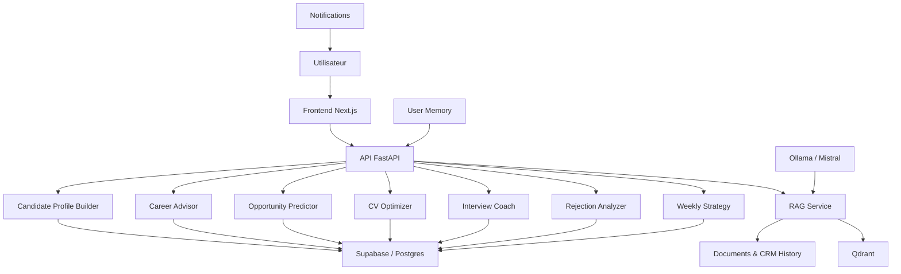

# Sprint 4 - Assistant IA Personnel, Coaching et Prédiction de Succès

## 1. Vue d'ensemble

Job Hunter AI évolue d'un moteur de détection d'offres vers un coach de carrière piloté par l'IA. Le système s'appuie sur l'historique CRM, les candidatures passées, les résultats d'entretiens et les profils métier pour offrir des recommandations explicables et des prédictions calculées.

## 2. Architecture fonctionnelle

## 3. Modules IA

- Candidate profile builder : consolidation CV, candidatures, emails, feedbacks, compétences et historique.
- RAG service : recherche conversationnelle sur le patrimoine de données utilisateur.
- Career advisor : recommandations de montée en compétence et axes d'amélioration explicables.
- Opportunity predictor : calcul de probabilité d'entretien, réponse et embauche.
- CV optimizer : analyse du CV par rapport aux offres.
- Cover letter generator : rédaction de lettres de motivation et emails de candidature.
- Interview coach : simulations techniques et RH.
- Rejection analyzer : analyse des refus et tendances de recrutement.
- Weekly strategy : plan d'action hebdomadaire.
- User memory : mémorisation persistante et apprentissage progressif.

## 4. Données et stockage

- Postgres/Supabase : candidatures, historique, applications, alerts, CRM.
- Qdrant : vecteurs des documents et historique utilisateur pour recherche RAG.
- Fichiers utilisateur : CV et notes privées, stockés selon les contraintes de confidentialité.

## 5. APIs IA

- POST /api/v1/ai/chat
- POST /api/v1/ai/analyze-cv
- POST /api/v1/ai/interview-coach
- POST /api/v1/ai/opportunity-score
- POST /api/v1/ai/career-advice
- GET /api/v1/ai/weekly-plan
- GET /api/v1/ai/insights

## 6. Bonnes pratiques

- explicabilité des scores
- données utilisateurs strictement sécurisées
- stockage vectoriel séparé du CRM relationnel
- modèle de scoring explicite et auditables
- mémoire utilisateur configurable et transparente
