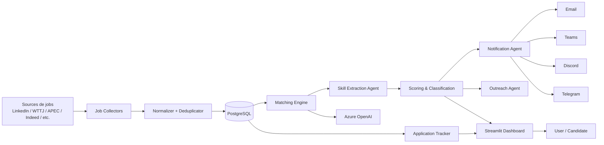
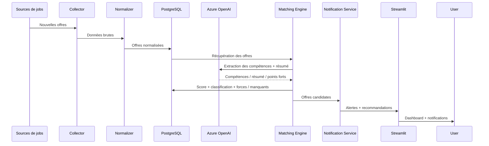
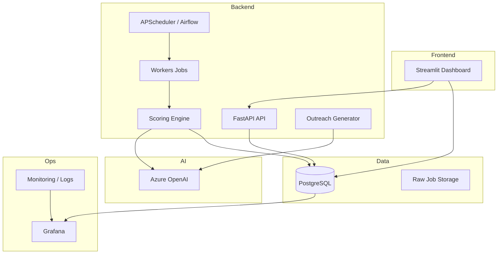
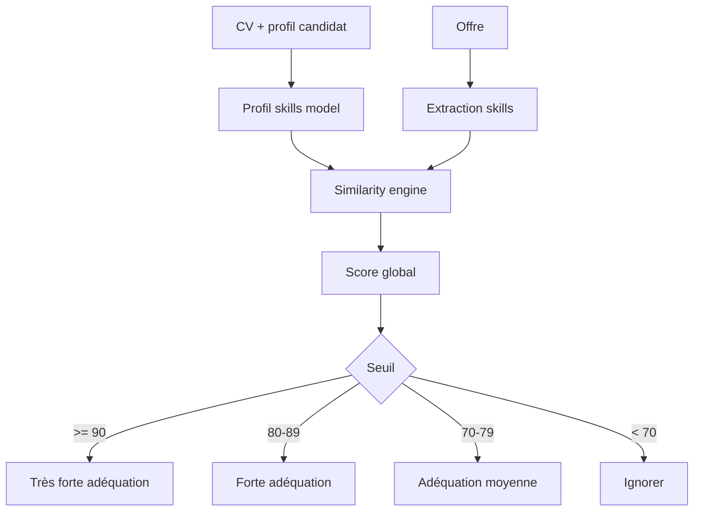
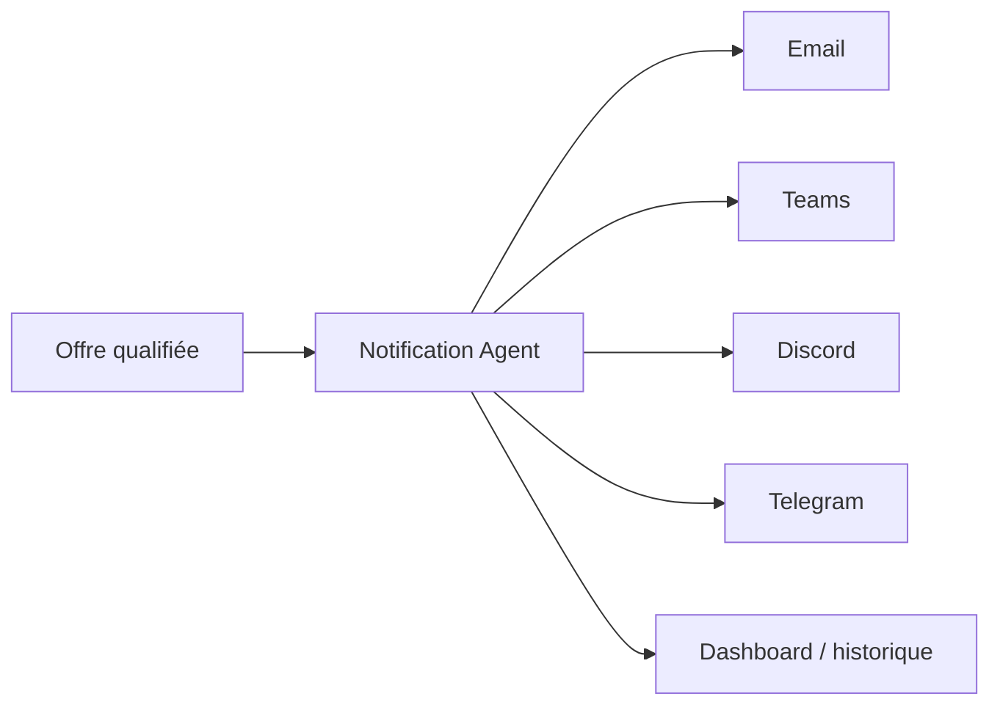

# Diagrammes du système

## 1. Diagramme des composants

## 2. Diagramme de flux de données

## 3. Diagramme d’architecture applicative

## 4. Diagramme de logique de score

## 5. Diagramme de notification

