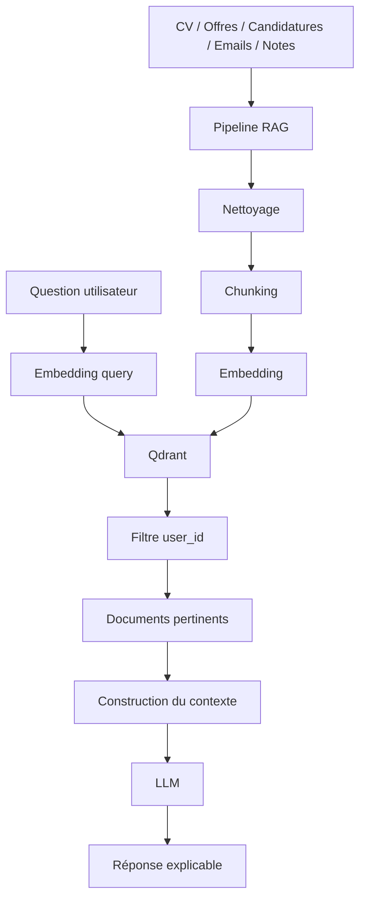

# Architecture RAG Job Hunter AI

## Objectif

Le moteur RAG permet à l’assistant IA de répondre à partir des données réelles d’un utilisateur, tout en assurant l’isolation absolue des données par `user_id`.

## Architecture fonctionnelle

- Données utilisateur : CV, offres, candidatures, emails, notes, feedbacks
- Ingestion : nettoyage, chunking, embedding, indexation Qdrant
- Recherche : embedding de la question, recherche vectorielle filtrée par `user_id`
- Contexte : documents pertinents + extrait + score + métadonnées
- Réponse : le modèle LLM construit la réponse uniquement à partir du contexte autorisé

## Diagramme Mermaid



## Flux d’ingestion

1. Charger le document source
2. Nettoyer le texte
3. Découper en chunks
4. Générer un embedding
5. Stocker dans Qdrant avec métadonnées : user_id, document_type, source_id, created_at

## Flux de recherche

1. L’utilisateur pose une question
2. La question est encodée
3. Qdrant applique un filtre `user_id`
4. Les meilleurs documents sont récupérés
5. Le contexte est consolidé avec score, document, extrait
6. Le LLM répond en s’appuyant dessus

## Schéma de collection Qdrant

- collection : `jobhunter_vectors`
- vecteur : embedding de taille configurable (`QDRANT_VECTOR_SIZE`)
- payload minimal :
  - `id`
  - `user_id`
  - `document_type`
  - `source_id`
  - `content`
  - `created_at`
  - `metadata`

## Sécurité

- Chaque recherche est filtrée par `user_id`
- Chaque point stocké contient le `user_id` du propriétaire
- Les documents d’un utilisateur ne sont jamais retournés à un autre
- L’intégration LLM future devra utiliser uniquement le contexte filtré

## Variables d’environnement

```env
QDRANT_URL=http://localhost:6333
QDRANT_API_KEY=
QDRANT_VECTOR_SIZE=768
QDRANT_COLLECTION=jobhunter_vectors
OLLAMA_BASE_URL=http://localhost:11434
OLLAMA_EMBED_MODEL=nomic-embed-text
OLLAMA_MODEL=llama3.2
MISTRAL_API_KEY=
MISTRAL_MODEL=mistral-small-latest
```

## Guide de validation

1. Démarrer Qdrant local : `docker compose up -d qdrant`
2. Vérifier l’API : `curl http://localhost:6333/collections`
3. Indexer un document utilisateur : `POST /api/v1/rag/index`
4. Rechercher avec `user_id` spécifique : `POST /api/v1/rag/search`
5. Vérifier qu’un autre `user_id` ne retourne aucun document cross-user
6. Vérifier le contexte explicable retourné par `POST /api/v1/rag/query`
7. Tester le chat protégé par JWT : `POST /api/v1/ai/chat` avec `Authorization: Bearer <token>`

## Limite actuelle

- Le moteur RAG est connecté au provider de génération de réponse.
- L’extension vers un LLM chat externe complet est prête, mais il reste à brancher les clés de production et l’environnement cible réel.
